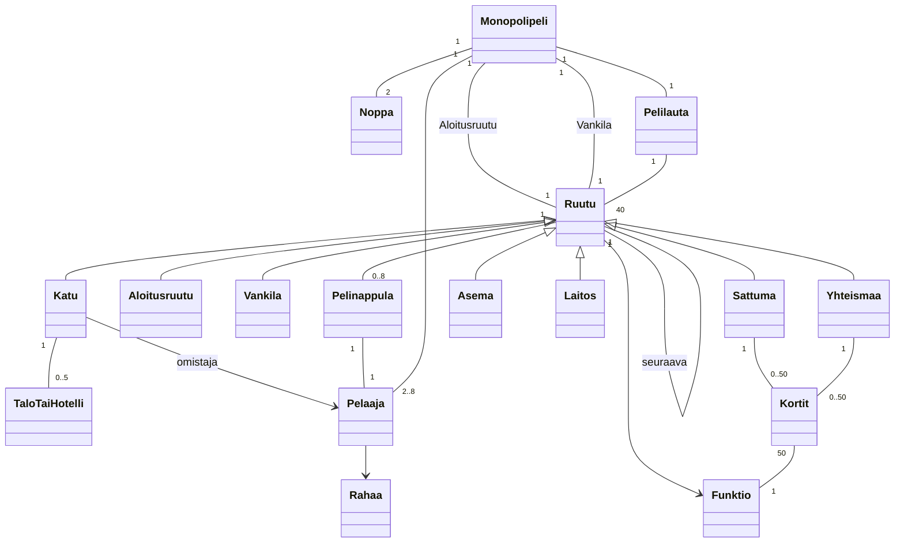

```mermaid
 classDiagram
    Monopolipeli "1" -- "2" Noppa
    Monopolipeli "1" -- "1" Pelilauta
    Monopolipeli "1" -- "1" Ruutu : Aloitusruutu
    Monopolipeli "1" -- "1" Ruutu : Vankila
    Pelilauta "1" -- "40" Ruutu
    Ruutu "1" -- "1" Ruutu : seuraava
    Ruutu "1" -- "0..8" Pelinappula
    Ruutu <|-- Aloitusruutu
    Ruutu <|-- Vankila
    Ruutu <|-- Sattuma
    Ruutu <|-- Yhteismaa
    Ruutu <|-- Asema
    Ruutu <|-- Laitos
    Ruutu <|-- Katu
    Ruutu --> Funktio
    Katu "1" -- "0..5" TaloTaiHotelli
    Katu --> Pelaaja : omistaja
    Sattuma "1" -- "0..50" Kortit
    Yhteismaa "1" -- "0..50" Kortit
    Kortit "50" -- "1" Funktio
    Pelinappula "1" -- "1" Pelaaja 
    Pelaaja "2..8" -- "1" Monopolipeli 
    Pelaaja --> Rahaa 

```