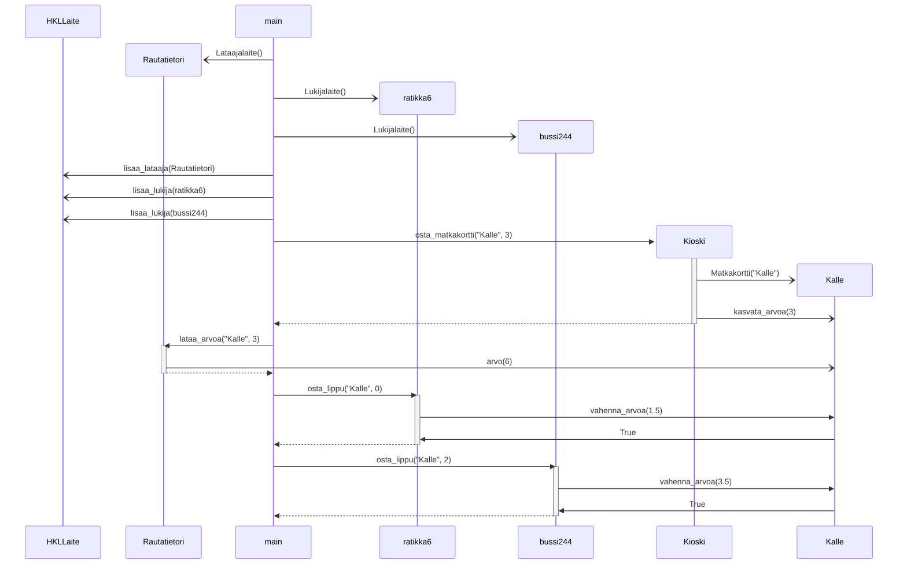

```mermaid
sequenceDiagram 
    participant HKLLaite
    create participant Rautatietori
    main-)Rautatietori: Lataajalaite()
    create participant ratikka6
    main-)ratikka6: Lukijalaite()
    create participant bussi244
    main-)bussi244: Lukijalaite()
    main-)HKLLaite: lisaa_lataaja(Rautatietori)
    main-)HKLLaite: lisaa_lukija(ratikka6)
    main-)HKLLaite: lisaa_lukija(bussi244)
    create participant Kioski
    main->>Kioski: osta_matkakortti("Kalle", 3)
    activate Kioski
    Create participant Kalle
    Kioski-)Kalle: Matkakortti("Kalle")
    Kioski-)Kalle: kasvata_arvoa(3)
    Kioski-->>main: 
    deactivate Kioski
    main->>Rautatietori: lataa_arvoa("Kalle", 3)
    activate Rautatietori
    Rautatietori-)Kalle: arvo(6)
    Rautatietori-->>main: 
    deactivate Rautatietori
    main->>ratikka6: osta_lippu("Kalle", 0)
    activate ratikka6
    ratikka6->>Kalle: vahenna_arvoa(1.5)
    Kalle->>ratikka6: True
    ratikka6-->>main: 
    deactivate ratikka6
    main->>bussi244: osta_lippu("Kalle", 2)
    activate bussi244
    bussi244->>Kalle: vahenna_arvoa(3.5)
    Kalle->>bussi244: True
    bussi244-->>main: 
    deactivate bussi244 

```
